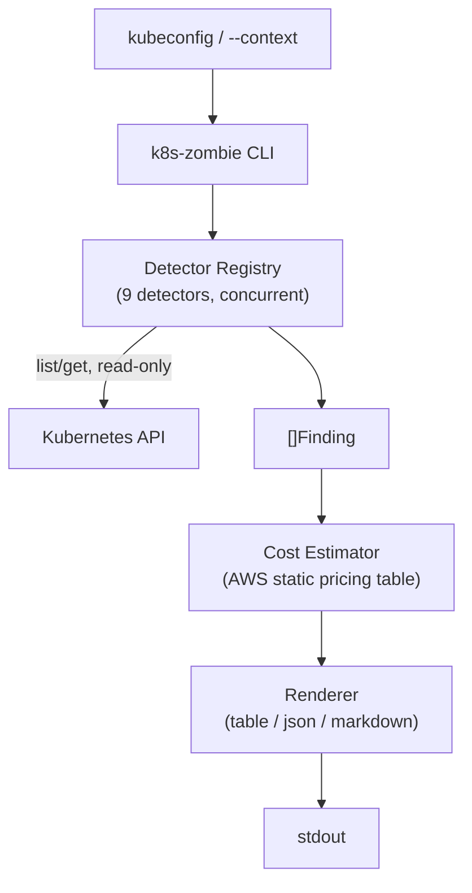

# k8s-zombie — Architecture

See `docs/adr/` for the individual decision records referenced below, and
`docs/specs/2026-09-04-k8s-zombie-design.md` for the full v1 design spec
this architecture formalizes.

## Requirements Summary

**Functional**
- Scan one Kubernetes cluster context (read-only) and detect 9 orphan resource types
  (unused namespaces, zero-endpoint Services/LBs, unattached PVCs, orphaned PVs, unused
  ConfigMaps/Secrets, orphaned Ingresses, idle Deployments, stale HPAs, completed/failed
  Jobs and Pods).
- Attach AWS $ cost estimates to detectors with a direct cost line (LBs, PVCs, orphaned
  PVs).
- Render findings as table (default), JSON, or Markdown.

**Non-functional**
- Never mutates cluster state — no delete calls anywhere in v1 (ADR-0005).
- Deterministic detection only — no heuristics/ML; every finding traceable to a
  specific API condition.
- Extensible — adding a new detector is a one-file change (ADR-0002).
- CI-friendly — fully stateless, no files persisted between runs (ADR-0003).
- RBAC-tolerant — a permissions gap on one resource type degrades gracefully.

**Constraints:** AWS-only cost data for v1 (ADR-0004), single cluster context per
invocation, Go, single static binary (ADR-0001).

## Architecture Diagram

## Technology Recommendations

- **CLI framework:** `cobra` + `pflag` — standard for Go CLIs, gives
  subcommands/flags/help generation for free.
- **K8s client:** `client-go`, with its `fake` clientset for unit tests.
- **Integration testing:** `sigs.k8s.io/controller-runtime/pkg/envtest` (or `kind` in
  CI) for the one full end-to-end scan test.
- **Release packaging:** `goreleaser` — cross-compiles, publishes GitHub releases, and
  generates a Homebrew tap formula from one config file.

## Risks & Mitigations

| Risk | Mitigation |
|---|---|
| ConfigMap/Secret detector false-positives (Helm hooks, external controllers reference them invisibly) | Labeled lower-confidence in the report (spec §5); documented prominently in README |
| Static pricing table goes stale | `--pricing-file` override + a documented quarterly update process; table is versioned so drift is visible |
| RBAC gaps vary wildly across real clusters | Per-detector `skipped` warning rather than a hard failure (ADR-0002) |
| Zero-endpoint Service false positive during rolling deploy (endpoints briefly empty) | Accepted for v1 per ADR-0003; documented known limitation |

## Build Order (v1)

1. Go module scaffold: `Finding`, `Detector` interface, registry, `client-go` wiring,
   `cobra` root command.
2. First two detectors (highest value, direct cost): **unattached PVCs**, **orphaned
   PVs** — plus the cost-estimator package and pricing YAML, proving the
   cost-attachment path end-to-end.
3. **Zero-endpoint Services** detector (proves the LB cost-estimation path).
4. Remaining no-cost detectors: namespaces, ConfigMaps/Secrets, Ingresses,
   Deployments, HPAs, Jobs/Pods.
5. Renderers: table → json → markdown.
6. `envtest`/`kind` integration test + CI pipeline + `goreleaser` packaging.
